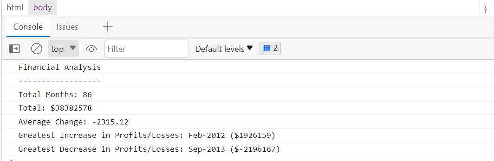

# Console-Finances
Financial analysis tool to analyze the financial records of a company

It calculates and displays the total number of months over the entire period
It computes the total profit/loss over the entire period and average change in profit/loss over the entire period. It also shows the greatest profit increase and greatest loss over any two consecutive months in the given period.

# Dependencies
None

# Project Link
https://sfsl06.github.io/Console-Finances/

# Authors
Contributors names and contact info
Sabeen Faisal sabeenjamil100@yahoo.com

# Built with
HTML CSS JavaScript

# Acknowledgements

https://www.javascripttutorial.net/javascript-multidimensional-array/
https://www.w3schools.com/js/